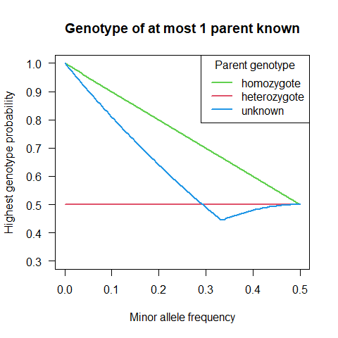
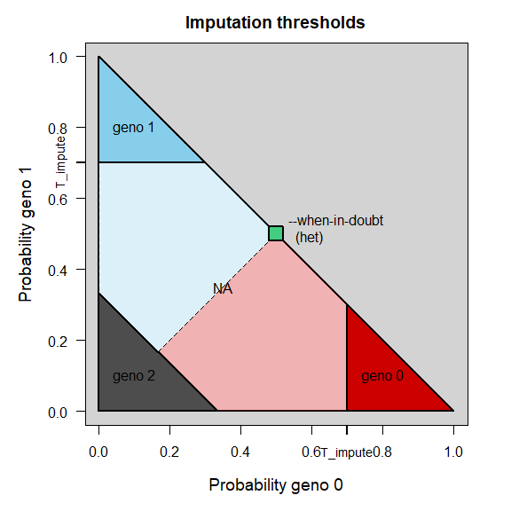

# Summary

This program imputes (fills in) missing SNP genotype data using a
pedigree. Neither the pedigree nor the SNP data is assumed to be
error-free.

Each SNP is treated completely independently; for programs that use
information from linked SNPs see e.g. Beagle or AlphaImpute.

## Quickstart

-   if you are on Windows, you need a linux-emulator, e.g. Cygwin
-   you need a Fortran compiler, e.g. gfortran or ifort
-   compile the source code into an executable program:
    `gfortran -O3 sqa_general.f90 sqa_fileIO.f90 imputator.f90 -o imputator`
-   create file `pedigree.txt` with columns id - parent1 - parent2.
    Column names are ignored, unknown parents should be coded as ‘NA’ or
    ‘0’.
-   create a genotype file, e.g. in PLINK .ped/.map format
-   run the program: `./imputator --geno <filename>`. For an overview of
    the options, run `./imputator --help`.

> [!CAUTION] 
> This program is under development and not extensively tested yet. Use is entirely at your own risk.

## Methods overview

The program offers several different imputation methods, which vary in
complexity, and therefore in computational speed and accuracy. From
simplest to most complex:

### `het`

Set all missing values to heterozygote. Does not require a pedigree.

### `common`

At each SNP, set all missing values to the most common genotype at that
SNP. Does not require a pedigree.

### `parents`

Derive the most-likely genotype from the observed parental genotypes.
E.g. if both parents are homozygous for the minor allele, the offspring
with a missing value will most likely also be homozygous for the minor
allele. Ignores non-genotyped parents.

### `ancestors`

As `parents`, with the addition that if e.g. the dam is not genotyped,
her probable genotype is derived from the maternal grandparents.

### `full`

The default method, which uses the full pedigree to calculate the most
likely genotype for each individual. This includes ancestors,
descendants, full siblings, and their mates.

The last method also allows the correction of some genotyping errors,
the others do not.

## Genotype format

Four different genotype formats are supported for input and output,
which are all internally converted to the ‘sequoia’ format:

### `SEQ` (sequoia, .txt)

No header row, IDs in column 1, then 1 column per SNP with genotypes
coded as 0, 1 or 2 copies of the reference (typically minor) allele,
with missing values coded as a negative integer.

### `RAW` (from PLINK `--recode A`, .raw)

Header row with SNP names, IDs in column 2 of 6 non-SNP columns, then 1
column per SNP with genotypes coded as 0, 1 or 2 copies of the reference
(typically minor) allele, with missing values coded as ‘NA’.

### `PED` (PLINK .ped/.map file pair)

No header row, IDs in column 2 of 6 non-SNP columns, then 2 columns per
SNP with alleles coded as A,C,T,G or as 1,2, and missing values coded as
0. The .map file contains the SNP names and positions. (position
information is not retained)

### `LMT` (.geno/.id file pair)

No header row, genotypes coded as 0/1/2 without spacing, missing values
not allowed, IDs in separate file.

------------------------------------------------------------------------

# Method `parent`

The tables show the imputed values for method=‘parents’. The imputed
values with methods ‘ancestors’ will often be the same.

Genotypes are coded as 0, 1 or 2 copies of the reference (minor) allele.

### Both parents genotyped

When both parents are genotyped and homozygous, the to be imputed
genotype is obvious (ignoring genotyping errors).

When one parent is homozygous and the other heterozygous, there is a
50/50 chance for the offspring to be heterozygous or an identical
homozygote. By default, the offspring is always imputed as heterozygous.
This can be changed with `--when-in-doubt` to the appropriate homozygote
(`hom`) or the most common genotype at the SNP (`com`, which may be the
‘other’ homozygote).

<table class=" lightable-paper" style="font-family: &quot;Arial Narrow&quot;, arial, helvetica, sans-serif; width: auto !important; margin-left: auto; margin-right: auto;">
<thead>
<tr>
<th style="padding-bottom:0; padding-left:3px;padding-right:3px;text-align: center; " colspan="1">

dam

</th>
<th style="padding-bottom:0; padding-left:3px;padding-right:3px;text-align: center; " colspan="3">

sire

</th>
</tr>
<tr>
<th style="text-align:left;">
</th>
<th style="text-align:left;">
0
</th>
<th style="text-align:left;">
1
</th>
<th style="text-align:left;">
2
</th>
</tr>
</thead>
<tbody>
<tr>
<td style="text-align:left;font-weight: bold;border-right:1px solid;">
0
</td>
<td style="text-align:left;">
0
</td>
<td style="text-align:left;">
\*
</td>
<td style="text-align:left;">
2
</td>
</tr>
<tr>
<td style="text-align:left;font-weight: bold;border-right:1px solid;">
1
</td>
<td style="text-align:left;">
\*
</td>
<td style="text-align:left;">
1
</td>
<td style="text-align:left;">
\*
</td>
</tr>
<tr>
<td style="text-align:left;font-weight: bold;border-right:1px solid;">
2
</td>
<td style="text-align:left;">
2
</td>
<td style="text-align:left;">
\*
</td>
<td style="text-align:left;">
0
</td>
</tr>
</tbody>
</table>

\*: value depends on `--when-in-doubt`, which defaults to `'het'`
(heterozygote, 1 allele copy).

### 0 or 1 parent(s) genotyped

When one or both parents are not genotyped at the SNP, the allele(s) are
assumed to be a random draw from a population in Hardy-Weinberg
Equilibrium. Consequently, genotypes at a SNP with a low minor allele
frequency (MAF) are imputed with a higher accuracy.

When one parent is heterozygous and the other parent’s genotype is
unknown, the offspring always has a 50% chance to be heterozygous,
irrespective of the population allele frequency *q*
($\frac{1}{2}\times q + \frac{1}{2}\times(1-q)$).

When both parental genotypes are unknown, the greatest uncertainty is
when $q=\frac{1}{3}$: then P(heterozygote) =
$2\times\frac{1}{3}\times\frac{2}{3} = \frac{4}{9} \approx 0.44$.

<table class=" lightable-paper" style="font-family: &quot;Arial Narrow&quot;, arial, helvetica, sans-serif; width: auto !important; ">
<thead>
<tr>
<th style="padding-bottom:0; padding-left:3px;padding-right:3px;text-align: center; " colspan="1">

AF

</th>
<th style="padding-bottom:0; padding-left:3px;padding-right:3px;text-align: center; " colspan="4">

sire

</th>
<th style="padding-bottom:0; padding-left:3px;padding-right:3px;text-align: center; " colspan="1">

most common

</th>
</tr>
<tr>
<th style="text-align:left;">
</th>
<th style="text-align:center;">
0
</th>
<th style="text-align:center;">
1
</th>
<th style="text-align:center;">
2
</th>
<th style="text-align:center;">
?
</th>
<th style="text-align:center;">
</th>
</tr>
</thead>
<tbody>
<tr>
<td style="text-align:left;font-weight: bold;border-right:1px solid;">
0.05
</td>
<td style="text-align:center;">
0
</td>
<td style="text-align:center;">
1
</td>
<td style="text-align:center;">
1
</td>
<td style="text-align:center;">
0
</td>
<td style="text-align:center;">
0
</td>
</tr>
<tr>
<td style="text-align:left;font-weight: bold;border-right:1px solid;">
0.1
</td>
<td style="text-align:center;">
0
</td>
<td style="text-align:center;">
1
</td>
<td style="text-align:center;">
1
</td>
<td style="text-align:center;">
0
</td>
<td style="text-align:center;">
0
</td>
</tr>
<tr>
<td style="text-align:left;font-weight: bold;border-right:1px solid;">
0.2
</td>
<td style="text-align:center;">
0
</td>
<td style="text-align:center;">
1
</td>
<td style="text-align:center;">
1
</td>
<td style="text-align:center;">
0
</td>
<td style="text-align:center;">
0
</td>
</tr>
<tr>
<td style="text-align:left;font-weight: bold;border-right:1px solid;">
0.3
</td>
<td style="text-align:center;">
0
</td>
<td style="text-align:center;">
1
</td>
<td style="text-align:center;">
1
</td>
<td style="text-align:center;">
0
</td>
<td style="text-align:center;">
0
</td>
</tr>
<tr>
<td style="text-align:left;font-weight: bold;border-right:1px solid;">
0.35
</td>
<td style="text-align:center;">
0
</td>
<td style="text-align:center;">
1
</td>
<td style="text-align:center;">
1
</td>
<td style="text-align:center;">
1
</td>
<td style="text-align:center;">
1
</td>
</tr>
<tr>
<td style="text-align:left;font-weight: bold;border-right:1px solid;">
0.45
</td>
<td style="text-align:center;">
0
</td>
<td style="text-align:center;">
1
</td>
<td style="text-align:center;">
1
</td>
<td style="text-align:center;">
1
</td>
<td style="text-align:center;">
1
</td>
</tr>
<tr>
<td style="text-align:left;font-weight: bold;border-right:1px solid;">
0.5
</td>
<td style="text-align:center;">
\*
</td>
<td style="text-align:center;">
1
</td>
<td style="text-align:center;">
\*
</td>
<td style="text-align:center;">
1
</td>
<td style="text-align:center;">
1
</td>
</tr>
<tr>
<td style="text-align:left;font-weight: bold;border-right:1px solid;">
0.55
</td>
<td style="text-align:center;">
1
</td>
<td style="text-align:center;">
1
</td>
<td style="text-align:center;">
2
</td>
<td style="text-align:center;">
1
</td>
<td style="text-align:center;">
1
</td>
</tr>
<tr>
<td style="text-align:left;font-weight: bold;border-right:1px solid;">
0.75
</td>
<td style="text-align:center;">
1
</td>
<td style="text-align:center;">
1
</td>
<td style="text-align:center;">
2
</td>
<td style="text-align:center;">
2
</td>
<td style="text-align:center;">
2
</td>
</tr>
<tr>
<td style="text-align:left;font-weight: bold;border-right:1px solid;">
0.95
</td>
<td style="text-align:center;">
1
</td>
<td style="text-align:center;">
1
</td>
<td style="text-align:center;">
2
</td>
<td style="text-align:center;">
2
</td>
<td style="text-align:center;">
2
</td>
</tr>
</tbody>
</table>

------------------------------------------------------------------------

# Method `full`

For each SNP and each individual, the probabilities that there are in
truth 0, 1, or 2 copies of the minor allele are estimated using the
method described in Kerr & Kinghorn, J. Anim. Breed. Genet., 1996
(<https://www.researchgate.net/profile/Richard-Kerr-7/publication/229737009_An_efficient_algorithm_for_segregation_analysis_in_large_populations/links/5a7a2e7c0f7e9b41dbd614f0/An-efficient-algorithm-for-segregation-analysis-in-large-populations.pdf>)

This probability depends on an individuals own genotype, the genotypes
of its parents and full siblings and their mates (‘anterior
probability’), and the genotypes of its offspring and their mates
(‘posterior probability’). See
`Kerr_Kinghorn_1996_equations_appendix.pdf` for a colour-coded
reproduction of the equations in the paper, which corrects a few
typesetting errors in the original.

The anterior and posterior probability of each individual depend on
those of many others, and can therefore not be calculated all at once.
This is especially true in a pedigree with inbreeding loops or other
pedigrees where individuals are related via multiple paths.

## Iterative peeling

Instead, first all anterior probabilities are calculated, starting from
the pedigree founders and working to the most recent individuals
(‘peeling down’). Then posterior probabilities are calculated, starting
from the bottom of the pedigree (individuals without offspring) and
working towards the top (‘peeling up’). Thirdly and lastly, the genotype
probabilities are calculated. These three steps are repeated until all
differences between the current genotype probabilities and those
calculated in the previous iteration differ less than the value `tol`
(default 0.0001, set with `--tol`).

## Imputation

Once the genotype probabilities are calculated, imputation is pretty
straight forward: where there is no observed genotype, select the one
(from options 0/1/2) with the highest probability. To only impute with
high certainty, set a high threshold `--T-impute`; create output that
contains no missing values at all, use `--T-impute 0`.

One difficulty is what to do when one parent is homozygous (0 or 2), and
the other is heterozygous (1), resulting in an (approximately) 50/50
chance of the individual being homozygous or heterozygous (when there is
no genotyped offspring). By default, these are set to heterozygous. This
can be changed to the most common genotype at that SNP
(`--when-in-doubt com`) or to homozygous (`--when-in-doubt hom`; default
is `het`).

## Genotype cleaning

Genotyping errors may negatively affect the imputation accuracy. Some
may be detected with high confidence as discrepancies between the
anterior and posterior probabilities, and the observed genotype. For
example, if both parents are homozygous for the major allele, and all
hundred offspring inherited the major allele, but the individual was
scored as a heterozygote, this is almost certainly incorrect.

Any such obvious errors are set to missing before the imputation step,
using threshold `--T-snpclean` (default: 0.01, i.e. only drop the
genotype if its probability is \< 0.01). This step can be skipped with
`--no-snpclean`.

Not all genotyping errors will be removed: when the genotypes of a
parent and offspring are inconsistent, it is not always clear which of
the two is incorrect. It is also not always directly clear what the new
genotype should be, as the individuals own, incorrect genotype is
included in the genotype probabilities (not doing so seems to increase
removal of the offspring genotype if the parent is wrong and v.v., but
further testing and optimising is needed).

The iterative peeling step is done before the genotype cleaning step,
and again between the genotype cleaning step and the imputation step.

------------------------------------------------------------------------

# Options

## Pedigree cleaning

Errors in the pedigree will also negatively affect the imputation
accuracy. Before imputation,  
for each parent-offspring pair it is checked whether their genotypes
across all SNPs are consistent with being parent and offspring, given
the genotyping error rate `--err`, or if they are more likely to be
otherwise related, or unrelated. For details, see
<https://github.com/JiscaH/sequoiaExtra/tree/main/pedigree_checker> .
Parent-parent-offspring trios are tested as two separate
parent-offspring pairs.

If the probability to be parent-offspring is less than `--T-pedclean`
(default: 0.05), the parent-offspring link is removed from the pedigree.
Removed links are written to file `pedclean_edits.txt`, with columns id,
parent_id, parent_sex, and the probabilities that the samples are from
the same individual (prob_S), parent-offspring (prob_PO), full siblings
(prob_FS), second degree relatives (prob_GP), third degree relatives
(prob_HA), or unrelated individuals (prob_UU).

Note that only genotyped-genotyped parent-offspring pairs are
considered. E.g. full sibling pairs where one or both parents are not
genotyped are not checked, for this run `sequoia`
(<https://github.com/JiscaH/sequoia_notR>) with only option
`--pedigreeIN <filename>`, which is analogous to function `CalcOHLLR()`
in the sequoia R package
(<https://jiscah.github.io/reference/CalcOHLLR.html> ).

This step can be skipped with `--no-pedclean`.

### `--T_impute`

It is possible to only impute cases where it is fairly certain what the
genotype should be, and leave the rest missing (NA). This can be done
with the threshold `T_impute`.

### `--when-in-doubt`

When two genotypes are nearly equally likely, it is by default imputed
always as heterozygote. This can be changed to the most common genotype
at the SNP (`com`) or the most-likely homozygote for the individual
(`hom`).

‘Nearly equally likely’ is currently defined as two genotypes having
probability  \> 0.49, but should and will be made dependent on the
presumed genotyping error rate `err`.

### `--err`, `--errV`

Presumed genotyping error rate. Either as a single value (`--err`) or as
3 values which give P(observed\|actual) for hom\|other hom, het\|hom,
and hom\|het. See ?sequoia::ErrToM in R for details.

### `--af`

Allele frequencies are by default calculated from the sample. Sometimes,
e.g. when the sample is small or contains mostly close relatives, it can
be advantageous to provide the allele frequencies estimated from a
larger sample. This can be the output file from `PLINK --freq`, or a
file with a single column with allele frequencies. SNPs need to be in
the exact same order as in the genotype data, SNP names are not checked.

### `--impute-all`

By default only ‘incidentally missing values’ are imputed, i.e. values
in individuals which are included in the genotype file. With
`--impute-all` all individuals in the pedigree file will be imputed.

### `--tol`

Used by `--method full` only; the iterative peeling is deemed to have
converged when all genotype probabilities after the current iteration
differ by less than `--tol` from those after the previous iteration.

## `--edits-in`

The log file contains all information to perform the imputation. It can
be convenient to first run the algorithm with `--no-geno-out`, e.g. to
first inspect the logfile, and then combine logfile and original
genotype file into an imputed genotype file, without having to re-do any
calculations.

This option can also used for parallel processing: split the genotype
file into N chunks, do the calculations on each chunk in parallel,
combine the logfiles, and apply the full list of edits to the original
genotype file.

## snpclean + imputation log

By default a log file is created with a record for each edit made to the
genotype data, irrespective of the imputation method chosen.

Column names are : ‘snp_index’, ‘snp_name’, ‘threshold’, ‘id_index’,
‘id_name’, ‘g_in’, ‘g_out’, ‘prob_0’, ‘prob_1’, ‘prob_2’. Here ‘index’
refers to the column number / row number in the genotype file, it is 0
for completely non-genotyped individuals in the pedigree (when
`--impute-all`). g_in and g_out are the genotypes in the genotypes in
the input and output genotype file, coded as 0/1/2 and -1 for missing
values.

Note that if a genotype was first set to missing by `snpclean`, and then
imputed by `impute`, there will be 2 entries in the log.

The filename for this log can be specified with `--edits-out`. The log
can also be turned off with `--no-edits-out`, which gives a slight speed
increase - which is neglible with `method=full`, but can be relatively
large for the faster methods.

# Algorithm details

To write.

# Future additions

## Thresholds

It is hoped to improve performance and make results less depended on
fairly arbitrary thresholds by repeating the SNP cleaning - imputation -
genotype probabilities steps multiple times, starting from very strict
thresholds and gradually loosening them (i.e. similar to simulated
annealing). This way, high-confidence imputations may in the next
iteration improve detection of genotyping errors and/or further
imputation.

## Estimate genotyping error rate

The genotyping error rate at each SNP can probably be estimated by
running the iterative peeling steps many times, for different values of
the presumed genotyping error rate `err`. The value resulting in the
highest total likelihood of the pedigree + SNP data (sum of genotype
probabilities across all individuals) is the most likely value of `err`.
